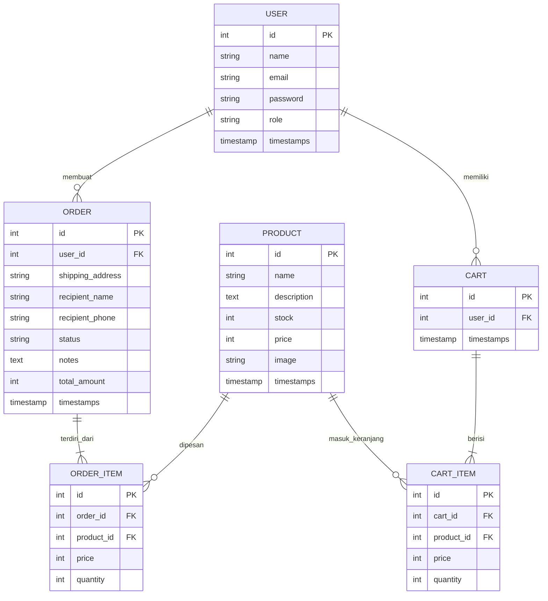
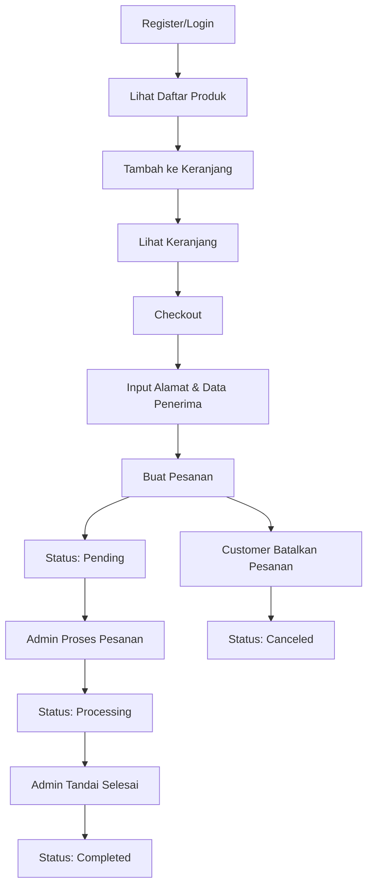
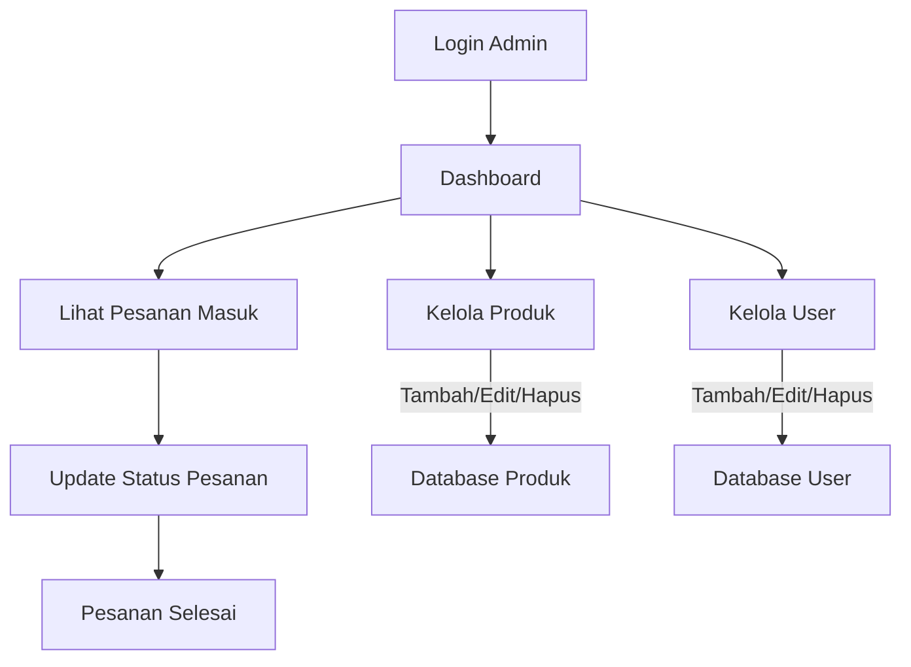
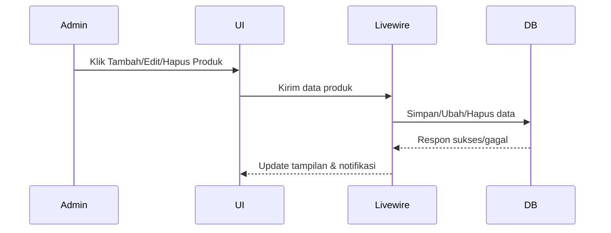
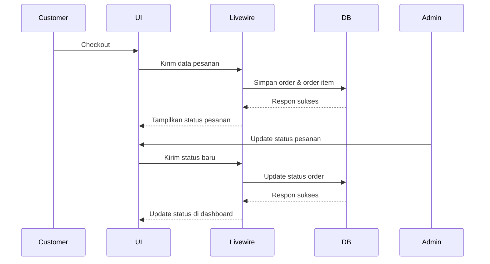
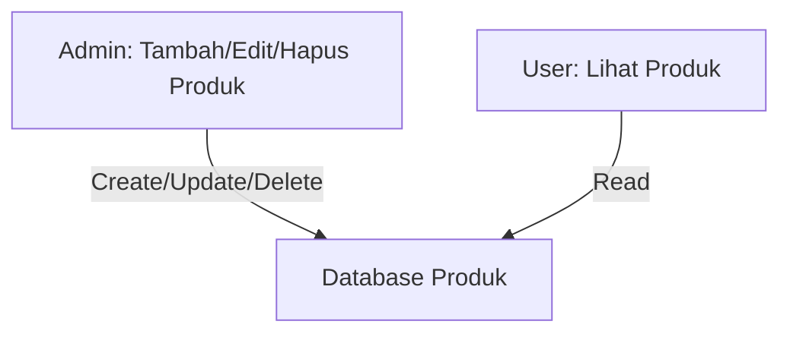
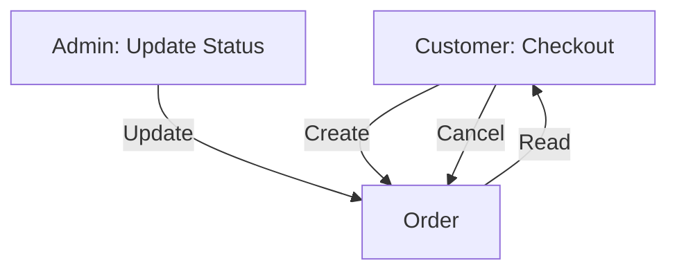

# Laporan Implementasi CRUD Toko Bunga

**Mata Kuliah:** Pemrograman Web Lanjutan  
**Nama:** Muhammad Syahrur  
**NIM:** 231240001362

---

## 1. Deskripsi Singkat

Toko Bunga adalah aplikasi web berbasis Laravel + Livewire yang menerapkan konsep CRUD (Create, Read, Update, Delete) untuk pengelolaan produk, pesanan, user, dan keranjang. Aplikasi ini mendukung peran admin dan customer, serta dilengkapi dashboard analitik dan UI/UX modern.

---

## 2. Rancangan Database

### 2.1. ERD (Entity Relationship Diagram)



### 2.2. Contoh Data

- **User**: name, email, password (hash), role
- **Product**: name, description, stock, price, image
- **Order**: user_id, shipping_address, recipient_name, recipient_phone, status, notes, total_amount
- **OrderItem**: order_id, product_id, price, quantity
- **Cart**: user_id
- **CartItem**: cart_id, product_id, price, quantity

---

## 3. Workflow CRUD & User Journey

### 3.1. Workflow Customer (Dari Registrasi hingga Pesan Selesai)


### 3.2. Workflow Admin (Manajemen CRUD)


### 3.3. Workflow CRUD Produk


### 3.4. Workflow CRUD Order


---

## 4. Implementasi CRUD

### 4.1. Produk (Product)
- **Create:** Admin dapat menambah produk baru (nama, deskripsi, harga, stok, gambar).
- **Read:** Semua user dapat melihat daftar produk (public & admin panel).
- **Update:** Admin dapat mengedit detail produk.
- **Delete:** Admin dapat menghapus produk.

### 4.2. Pesanan (Order)
- **Create:** Customer membuat pesanan dari cart.
- **Read:** Customer & admin dapat melihat riwayat/detail pesanan.
- **Update:** Admin dapat mengubah status pesanan (pending, processing, completed).
- **Delete:** Customer dapat membatalkan pesanan selama status pending.

### 4.3. User
- **Create:** Register user baru (otomatis role customer).
- **Read:** Admin dapat melihat daftar user.
- **Update:** Admin dapat mengubah data user (opsional).
- **Delete:** Admin dapat menghapus user (opsional).

### 4.4. Cart & CartItem
- **Create:** Customer menambah produk ke keranjang.
- **Read:** Customer melihat isi keranjang.
- **Update:** Customer mengubah jumlah item di keranjang.
- **Delete:** Customer menghapus item dari keranjang.

---

## 5. Contoh Kode Model & Relasi (Laravel Eloquent)

```php
// app/Models/User.php
public function orders() { return $this->hasMany(Order::class); }
public function cart() { return $this->hasOne(Cart::class); }

// app/Models/Product.php
public function orderItems() { return $this->hasMany(OrderItem::class); }
public function cartItems() { return $this->hasMany(CartItem::class); }

// app/Models/Order.php
public function user() { return $this->belongsTo(User::class); }
public function items() { return $this->hasMany(OrderItem::class); }

// app/Models/OrderItem.php
public function order() { return $this->belongsTo(Order::class); }
public function product() { return $this->belongsTo(Product::class); }

// app/Models/Cart.php
public function user() { return $this->belongsTo(User::class); }
public function items() { return $this->hasMany(CartItem::class); }

// app/Models/CartItem.php
public function cart() { return $this->belongsTo(Cart::class); }
public function product() { return $this->belongsTo(Product::class); }
```

---

## 6. Visualisasi Alur CRUD

### 6.1. Alur CRUD Produk


### 6.2. Alur CRUD Pesanan


---

## 7. Fitur Tambahan
- Dashboard analitik (Chart.js)
- SweetAlert2 konfirmasi hapus
- Livewire Alert notifikasi
- Validasi bahasa Indonesia
- Lacak pesanan tanpa login
- Responsive UI/UX

---

## 8. Penutup

Aplikasi ini mengimplementasikan seluruh aspek CRUD dengan relasi database yang jelas, UI modern, dan fitur analitik.